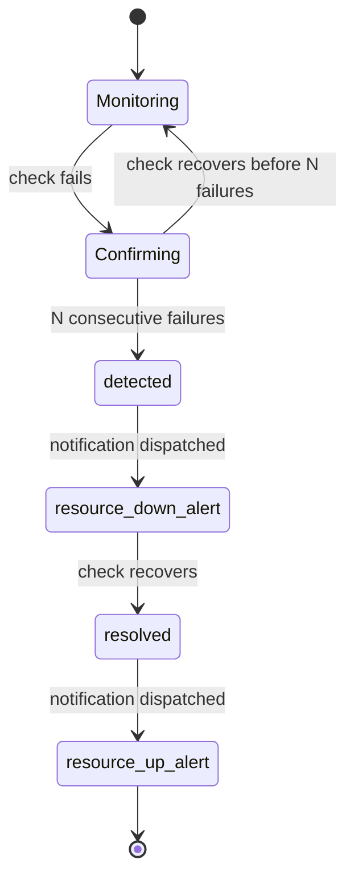

# Incidents & confirmation

## Why confirmation

Most monitoring tools alert on the first failed check. Ogoune confirms failures before creating an incident — the difference between a real outage and a 2-second blip.

## Confirmation window

A monitor opens an incident only after **N consecutive failed checks**. Until then, failures are recorded but no alert fires.

## Flap detection

Rapidly alternating up/down states are damped so you don't get an alert storm from a flapping service.

## Alert grouping

Related failures are grouped so a single upstream outage doesn't produce dozens of separate pages.

## Lifecycle steps

`detected` · `resource_down_alert` · `resolved` · `resource_up_alert` — steps may not all be present for every incident.

::: tip
Not every incident carries all four steps — e.g. a resolved incident with no configured
notification channel skips the alert steps but still records `detected` and `resolved`.
:::

## What happened around it

When an incident's monitor is attached to a host, and that host's kernel reported
something in the same few minutes, the incident says so in one sentence at the top
of the page:

> HTTP check failed: 502 Bad Gateway at 2026-09-10 14:03:00 UTC. The kernel
> OOM-killed postgres (pid 4711) on web-01 at 2026-09-10 14:02:47 UTC, 13 seconds
> earlier.

The same sentence goes into the notification, so the first thing you read when you
are woken is not "the site is down" but "the site is down, and the kernel killed a
process on that host seconds before".

The kernel events behind the sentence are listed beneath it, so you can check the
claim instead of taking it.

### What it claims, and what it does not

The rule is a **time window and nothing else**: the same window the host context
uses, from five minutes before the failure to one minute after. If a kernel event
falls inside it, you are shown both facts and both times. If none does, nothing
appears — no sentence saying nothing was found.

That is a **co-occurrence, not a proven cause**, and the interface says so. There
is no confidence score, no percentage, and no "likely cause" label, because two
things happening close together on one machine is exactly as much as the data
knows. Both timestamps are always shown so you can overrule the sentence when it
is wrong.

One consequence worth knowing: a monitor's host is resolved when you open the
page, not frozen when the incident happened. If you move a monitor to a different
host, its old incidents will correlate against the new one. Check the host name in
the sentence before acting on an old incident.

### One sentence, however many events

A saturated host can produce dozens of kernel reports. You get one sentence: it
names one event and says how many others fell in the same window. It never becomes
a list. Two counts are kept apart on purpose — how many times the named event was
reported ("Reported 37 times") and how many *other* events there were — because
they answer different questions.

An event of a kind this version does not recognise is still listed, and still
counted, but is never named in the sentence.

### Why the alert and the page can disagree

An incident opens the moment its confirmation window completes, and the
notification goes out immediately. The agent pushes kernel events on its own
schedule, roughly every ten seconds. So an out-of-memory kill that really did
precede the failure can reach Ogoune just *after* the alert was sent.

When that happens the alert has no sentence and the incident page does. That is
the intended behaviour, not a bug: your alert is never delayed waiting for a
correlation, and you are never woken a second time to be told why. Because
confirmation normally takes minutes and the agent pushes every few seconds, the
alert almost always has the sentence anyway.

### When it is not shown

- The monitor has no host attached — the common case, and it costs nothing.
- No kernel event fell inside the window.
- The host's agent cannot read kernel events at all. See
  [kernel events](/self-host/agent#kernel-events) — a container usually cannot
  read `/dev/kmsg`, though the cgroup source often still catches out-of-memory
  kills.
- Nothing is shown for host metrics that have aged out. Metrics and kernel events
  have different retentions, so an old incident often has the sentence without the
  CPU and memory context beside it.
